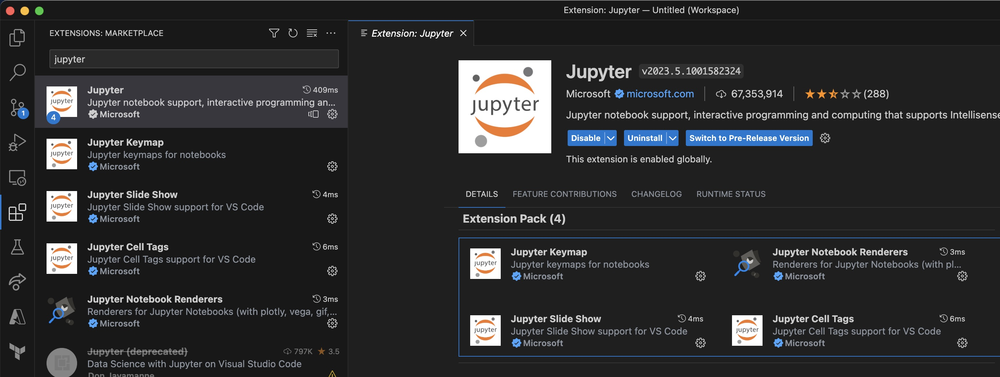
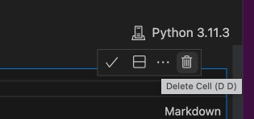
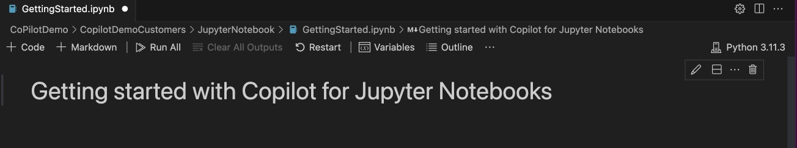
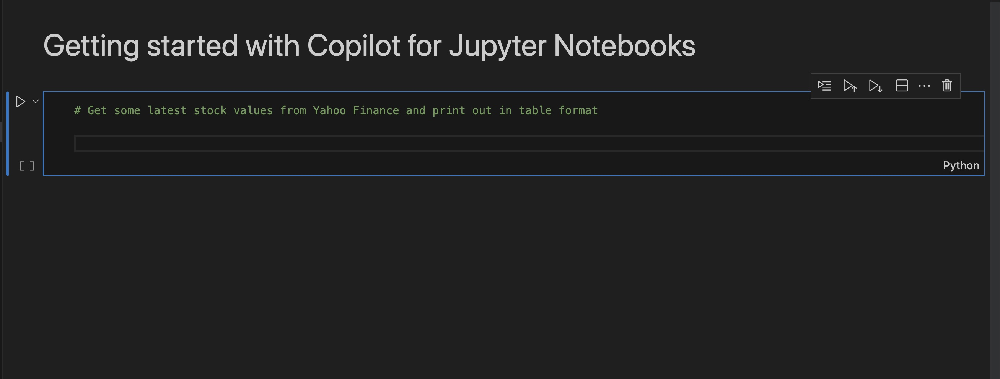
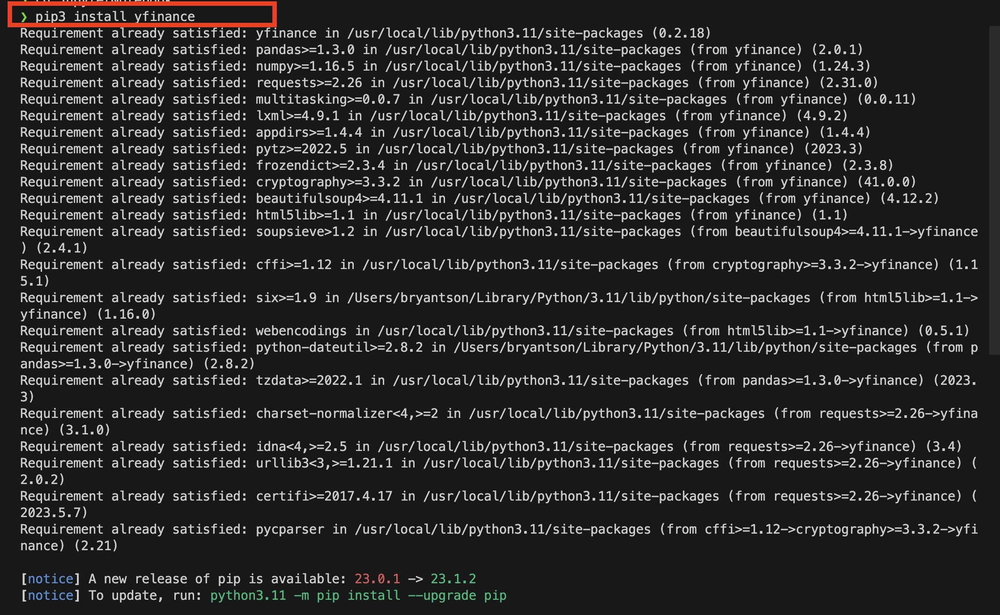
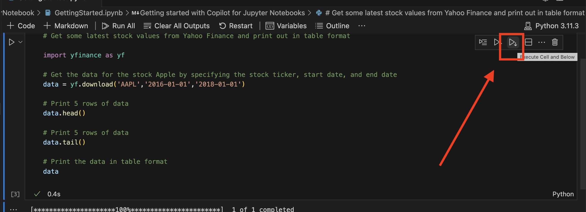
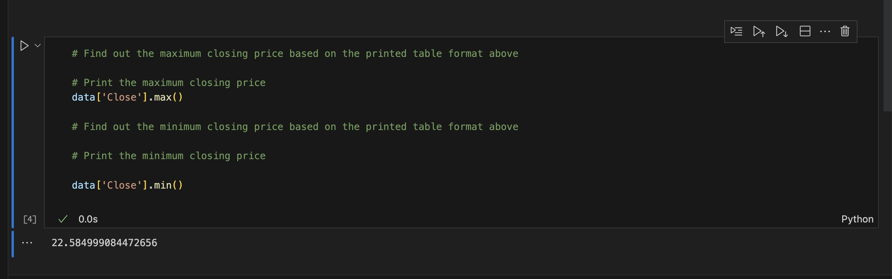

# Starting with Jupyter Lab with Copilot through VS Code

This is a demo you can start with to get familiar with Copilot for Jupyter Notebooks. This demo is going to show you how to use Copilot to generate code for Jupyter Notebooks.

## Prerequisites

- [VS Code](https://code.visualstudio.com/download)
- Jupyter Notebook Extension for VS Code
- Python pip for installing Python packages 
- [GitHub Copilot](https://copilot.github.com/)
  - [Jupyter](https://marketplace.visualstudio.com/items?itemName=ms-toolsai.jupyter)

## Steps

Welcome! In this starting Copilot demo for Jupyter Notebooks, you will learn how to use Copilot to generate code for Jupyter Notebooks. We will create a file called `GettingStarted.ipynb` and write some code to get the history of a stock value from Yahoo Finance, finding out a max value, and plot the overall result based on the data table.

### Step 1: Open VS Code and create a new folder or open an existing folder.

First thing you want to do is to open VS code inside a folder. You can either create a file named `GettingStarted.ipynb` or open a blank Jupiter Notebook file called `GettingStarted.ipynb`

### Step 2: Create a new markdown option `GettingStarted.ipynb`

Next, you want to open the file `GettingStarted.ipynb`. In there, you will see two options `+ Code` and `+ Markdown` appear when you hover over it. Click `+ Markdown`.

After that, start entering `#` followed by a space, and some title. For example, I typed '# Getting started with Copilot for Jupyter Notebooks'. As you will see, Copilot will try to suggest you some text. You can either press `Tab` to accept the suggestion or keep typing to ignore it.

After you are done, click `check icon` on right side. If you want to delete, you can click `trash can` icon.

After you clicked `check icon`, you will see the markdown title appear in the file.

### Step 3: Create a first code to get data from Yahoo Finance

Next, we will try something fun by pull a stock information from Yahoo Finance. To do that, we need move our mouse little below and hover over the space again. This time, we will select `+ Code` option.

Start typing a comment that may look like this: `# Get some latest stock values from Yahoo Finance and print out in table format`

You can decide to override the code or comment if needed. Just to make sure to test often.

If you import the package, you need to install Python dependencies. You can open `Terminal` and run command like `pip3 install yfinance` to install the package. However, you can also create `requirements.txt` and run `pip3 install -r requirements.txt` to install all the packages at once.

Returning back to your code, you will see Copilot keeps suggesting a line or even entire blocks of lines. You can decide to override if you want to, but yours will look something like this. Click on `a right triangle icon with a down arrow icon` to `Execute Cell and Below`.

Once you have done that, you will see that the table is printed out in the output section. There is your first execution with Jupyter Notebook and Copilot!

### Step 4: Another exercise printout the maximum value 

Let's do two more exercises. Let's move your mouse below and click `+ Code` again.

This time, though, we will try to find the maximum value from the table. You can start typing a comment like `# Find the maximum closing price based on the printed table format above` and go to next line. Then, your Copilot will suggest codes for you. As always, you can always override the suggested codes. After all, your Copilot is your assistant, not your boss.

After you are done, hit `Execute Cell and Below` again. You will see the maximum value printed out in the output section.

### Step 5: Last exercise to plot the data

We will now plot the data. You will create another code block by clicking `+ Code` again. Start typing a comment like `# Plot the closing price of the AAPL stock` and it will autocomplete for you. Hit tabs to see suggestions, execute the cell, and you will see the plot in the output section.

That is it! You have completed the first exercise with Copilot for Jupyter Notebooks. You can try to do more exercises by yourself or move on to the next exercise.